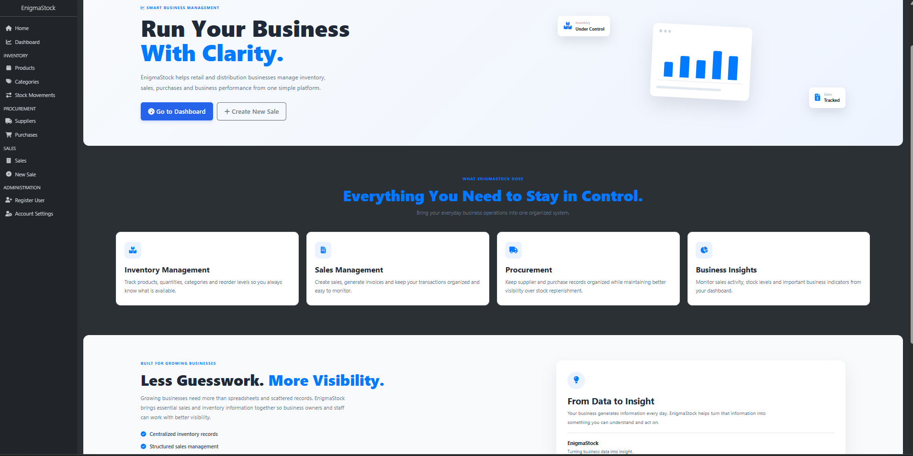
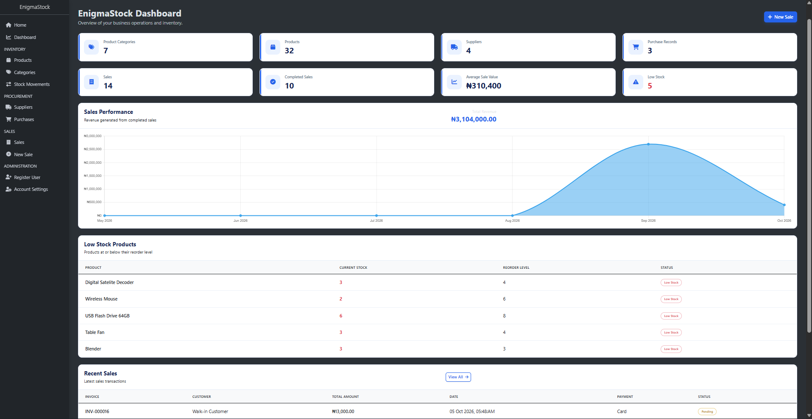
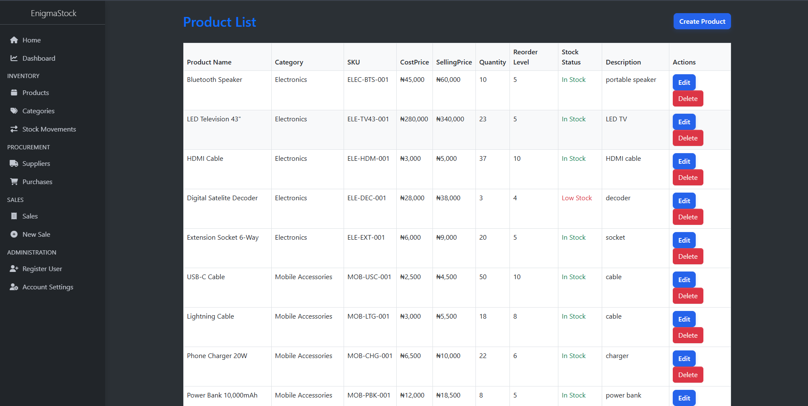
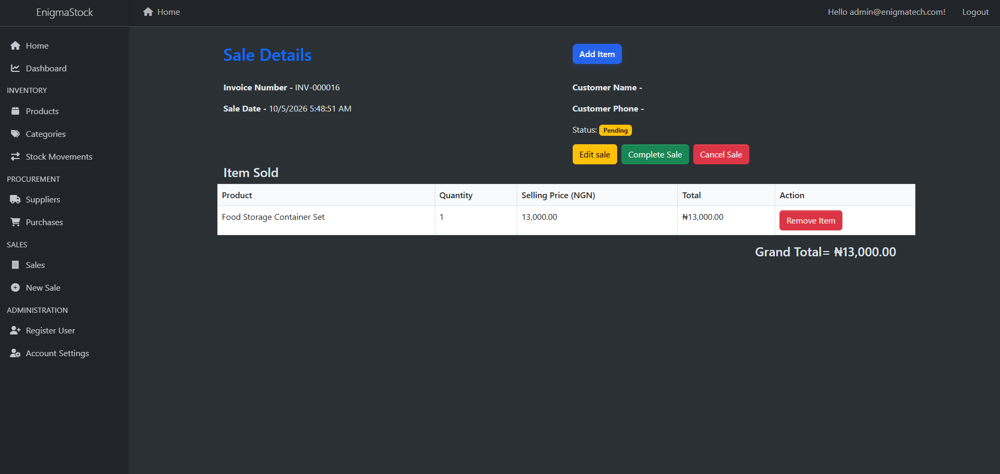
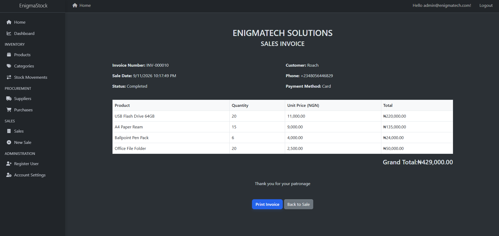

# EnigmaStock

### Retail & Distribution Inventory and Sales Management System

**EnigmaStock** is a web-based inventory and sales management system built to help retail and distribution businesses manage products, stock levels, sales transactions, customers, and invoices from a centralized platform.

The project was developed as a practical **ASP.NET Core MVC** application, with emphasis on clean application structure, database-driven workflows, authentication, authorization, and real-world business logic.

> **Built by Enigmatech Solutions — Turning business operations into structured digital workflows.**

---

## Overview

Many small and medium-sized businesses still rely heavily on spreadsheets and manual processes to manage inventory and sales.

EnigmaStock provides a centralized system for managing these operations while reducing manual work and improving visibility into business activities.

The application allows authorized users to:

* Manage products and categories
* Monitor inventory levels
* Record stock movements
* Create and manage sales
* Track customers
* Monitor pending and completed transactions
* Generate sales invoices
* Manage users and access permissions
* View key business information through a dashboard

---

## Key Features

### 📊 Dashboard

The dashboard provides an overview of important business activities, including:

* Total products
* Product categories
* Suppliers
* Purchases
* Sales
* Low-stock products
* Recent sales
* Revenue information
* Current inventory status

The dashboard is designed to give users a quick view of the current state of the business.

---

### 📦 Product & Inventory Management

EnigmaStock allows users to manage products and maintain accurate inventory records.

Product information includes:

* Product name
* Category
* SKU
* Cost price
* Selling price
* Current quantity
* Reorder level

The system also supports inventory movement through **Stock In** and **Stock Out** records.

Low-stock products can be identified based on their configured reorder levels.

---

### 💰 Sales Management

The sales module provides an end-to-end workflow for recording customer transactions.

Users can:

* Create a new sale
* Record customer information
* Select payment methods
* Add products to a sale
* Specify quantities
* Remove items
* Edit pending sales
* Complete sales
* Cancel sales
* Delete cancelled transactions when required

Each sale follows a controlled status workflow:

```text
Pending
   │
   ├── Add / Remove Items
   ├── Edit Sale
   │
   ├── Complete ──→ Completed
   │
   └── Cancel ────→ Cancelled
```

Completed transactions are treated as finalized records and cannot be edited or cancelled.

---

### 🧾 Invoice Generation

Completed sales can be converted into a professional sales invoice.

Invoices include:

* Invoice number
* Sale date
* Customer information
* Payment method
* Products purchased
* Quantity
* Unit selling price
* Item totals
* Grand total

The system automatically calculates transaction totals based on product quantity and selling price.

Invoices can also be printed or saved as PDF using the browser's native printing functionality.

---

### 🔐 Authentication & Authorization

EnigmaStock uses ASP.NET Core Identity to manage user authentication and access control.

The application implements role-based authorization to ensure that users only have access to functionality appropriate to their role.

For example, administrative functionality can be restricted while staff users are limited to permitted operational areas.

---

## Sales Workflow

The core sales process follows a structured workflow:

```text
Create Sale
     ↓
Enter Customer Information
     ↓
Select Payment Method
     ↓
Add Products
     ↓
Specify Quantities
     ↓
Review Sale
     ↓
Complete Sale
     ↓
Invoice Available
     ↓
Print Invoice
```

This approach separates transaction creation from product selection and finalization, allowing pending transactions to be reviewed before completion.

---

## Technology Stack

| Technology                | Purpose                          |
| ------------------------- | -------------------------------- |
| **ASP.NET Core MVC**      | Web application framework        |
| **C#**                    | Application programming language |
| **Entity Framework Core** | Database access and ORM          |
| **SQL Server**            | Relational database              |
| **ASP.NET Core Identity** | Authentication and authorization |
| **Razor Views**           | User interface                   |
| **Bootstrap**             | Responsive UI                    |
| **AdminLTE**              | Dashboard interface              |
| **Font Awesome**          | Icons                            |
| **Chart.js**              | Dashboard visualizations         |
| **Git & GitHub**          | Version control                  |

---

## Application Architecture

EnigmaStock follows the **ASP.NET Core MVC** architecture.

```text
EnigmaStock
│
├── Controllers
│   ├── DashboardController
│   ├── ProductController
│   ├── SaleController
│   ├── SupplierController
│   └── ...
│
├── Models
│   ├── Product
│   ├── Sale
│   ├── SaleItem
│   ├── Supplier
│   ├── Purchase
│   └── ...
│
├── Data
│   └── ApplicationDbContext
│
├── Views
│   ├── Dashboard
│   ├── Product
│   ├── Sale
│   ├── Supplier
│   └── ...
│
└── wwwroot
    ├── css
    ├── js
    └── libraries
```

The application uses **Entity Framework Core** to manage communication between the application and SQL Server database.

---

## Database

The application uses **SQL Server** with Entity Framework Core.

The database contains entities supporting major business operations such as:

* Products
* Categories
* Sales
* Sale Items
* Suppliers
* Purchases
* Stock movements
* Users and roles

Entity relationships allow sales to contain multiple products while maintaining product and inventory information centrally.

---

## User Interface

The application uses a responsive administrative interface based on **AdminLTE and Bootstrap**.

The interface includes:

* Sidebar navigation
* Dashboard cards
* Data tables
* Forms
* Status badges
* Action buttons
* Responsive layouts
* Charts and visual summaries

### Screenshots

### Home


### Dashboard


### Products


### Sales


### Invoice


### Stock Movement History

---

## Getting Started

### Prerequisites

Before running EnigmaStock locally, ensure you have:

* .NET 8 SDK
* Visual Studio 2022 or later
* SQL Server
* SQL Server Management Studio (optional)
* Git

### Clone the Repository

```bash
git clone https://github.com/enigmatechsolution/EnigmaStock.git
cd EnigmaStock
```

### Configure the Database

Update the connection string in:

```text
appsettings.json
```

Example:

```json
"ConnectionStrings": {
  "DefaultConnection": "Server=(localdb)\\MSSQLLocalDB;Database=EnigmaStock;Trusted_Connection=True;TrustServerCertificate=True"
}
```

### Apply Database Migrations

Run:

```bash
dotnet ef database update
```

### Run the Application

```bash
dotnet run
```

Or open the project in Visual Studio and run it using the configured development profile.

---

## Security

Security considerations implemented in the application include:

* User authentication
* Role-based authorization
* Restricted controller actions
* Protected administrative functionality
* Server-side validation
* Controlled sales transaction states

The application is designed so that sensitive operational functionality is not freely accessible to every authenticated user.

---

## Future Improvements

Potential future improvements include:

* Advanced sales and inventory reporting
* Improved analytics and business intelligence
* Barcode scanning
* Automated low-stock notifications
* Customer management enhancements
* Supplier performance tracking
* Online deployment
* Cloud database support
* Automated invoice delivery
* Integration with external payment services

---

## Project Purpose

EnigmaStock was developed as a practical software project to apply real-world concepts in:

* ASP.NET Core MVC
* C#
* Entity Framework Core
* SQL Server
* Authentication & Authorization
* CRUD operations
* Database relationships
* Business logic
* Inventory management
* Sales workflows
* Role-based access control
* Responsive web application development

The project also serves as a demonstration of how **Enigmatech Solutions** can build digital infrastructure for retail and distribution businesses.

---

## Author

### Abdulakeem Oluwaseun Lawal

**Data Analyst | ASP.NET Developer | Founder, Enigmatech Solutions**

**Portfolio:** datascienceportfol.io/kimzihollick

> Turning data and business processes into structured, practical digital solutions.

---

## License

This project is developed as a portfolio and demonstration project.

© 2026 Enigmatech Solutions. All rights reserved.
